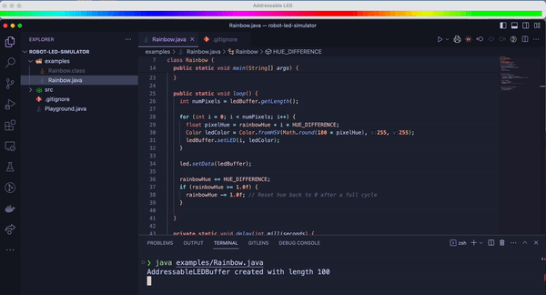

# LumaLab

A new training and debugging tool to practice LED code on local hardware! Perfect for finding working in your LED code quickly, or training exercises for rookies!

Follows WPILIB led protocol!

## Demo

